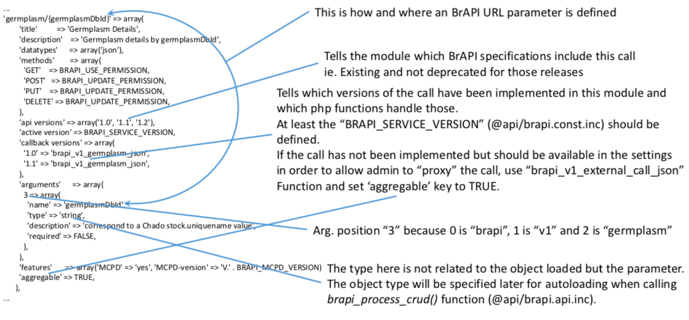
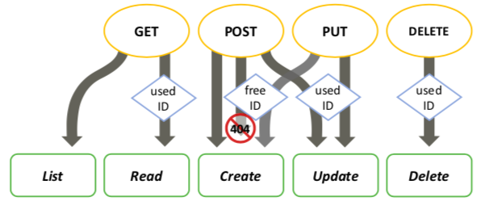

Process Overview
==================

This section attempts to explain how Tripal-BrAPI handles calls.

How BrAPI calls are handled
-----------------------------

**Example: ``https://www.crop-diversity.org/mgis/brapi/v1/germplasm/01BEL084609``** where ``https://www.crop-diversity.org/mgis`` is the Drupal site root.

1. Drupal hook_menu called ``brapi_menu()`` (in ``brapi.module``) to resolve URL handling. ``brapi_menu()`` provides to Drupal supported BrAPI calls as they are defined in ``brapi_get_calls()`` (in ``api/brapi.const.inc``).

Here, the system will select the call defined by the ``germplasm/{GermplasmDbId}`` key of the array returned by brapi_get_calls():

.. note::

  Any call setting defined by ``brapi_get_calls()`` can be overridden by external module using the hook ``hook_brapi_calls_alter(&$brapi_calls)``, ``$brapi_calls`` being the array returned by ``brapi_get_calls()``. Call versions are selected on the BrAPI setting administration interface.

2. For every BrAPI call, Drupal will call ``brapi_call_wrapper()`` (in ``api/brapi.calls.inc``) that will then call the function specified by ``brapi_get_calls()`` at the ``callback versions`` key. ``brapi_call_wrapper()`` will check permissions and select the appropriate call version.

Here, we assume current user has ``BRAPI_USE_PERMISSION`` and used GET HTTP method: ``brapi_v1_germplasm_json()`` (in ``api/brapi.calls.inc``) function will be called.

3. Then ``brapi_call_wrapper()`` will allow external modules to override returned data before being served to the client if they implement ``hook_brapi_CALL_FUNC_NAME_alter(&$data, &$context)``.
Here, any implementation of ``hook_brapi_germplasm_germplasmDbId_alter(&$data, &$context)`` will be called. Note, it is also possible to alter call result in case of errors.

4. Finally, ``brapi_output_json()`` (in ``api/brapi.api.inc``) will be called to format data into a JSON string that will be served by Drupal to the client.

How ``brapi_v1_germplasm_json()`` works
-----------------------------------------

1. ``brapi_call_wrapper()`` calls ``brapi_v1_germplasm_json()`` (in ``api/brapi.calls.inc``). As the "germplasm" call deals with a germplasm "resource" (as defined in RESTFull architecture, or "object", or "entity", or whatever you want to call it), it will call ``brapi_process_crud()`` (in ``api/brapi.api.inc``). CRUD stands for Create-Read-Update-Delete and is part of the RESTFull architecture.

2. ``brapi_process_crud()`` will decide, according to the context (HTTP method used, identifier provided), which action should be done:

``brapi_process_crud()`` will load the corresponding resource in case of a used ID provided and will then call the function corresponding to the action to perform. Action functions are provided by the ``$action`` parameter:

.. code:: php

  $actions = array(
    'create' => 'brapi_v1_create_germplasm_json',
    'read' => 'brapi_v1_read_germplasm_json',
    'update' => 'brapi_v1_update_germplasm_json',
    'delete' => 'brapi_v1_delete_germplasm_json',
    'list' => 'brapi_v1_germplasm_search_json',
  );

Here, ``brapi_v1_read_germplasm_json()`` (in ``api/brapi.calls.inc``) will be called with a "germplasm" resource of ID ``01BEL084609`` loaded (using ``chado_generate_var()``) as argument.

3. ``brapi_v1_read_germplasm_json()`` (in ``api/brapi.calls.inc``) will prepare and return the data structure that will be converted later into JSON:

.. code:: php

  function brapi_v1_read_germplasm_json($stock) {

    // It initializes the metadata part of the BrAPI call answer.
    // Here we only have 1 element, so we set the pager to 1 element.
    $metadata = brapi_prepare_metadata(1);

    // This can be used to output debugging information into the call.
    $debug_data = array();

    // See step 4 below.
    $germplasm_data = brapi_get_germplasm_details($stock);

    // It initializes the data part of the BrAPI call answer.
    $data = array('result' => $germplasm_data);

    // See step 5 below.
    brapi_aggregate_call($data, $metadata, $debug_data);

    // return the results.
    return array(
      $data,
      $metadata,
      $debug_data,
    );
  }

4. ``brapi_get_germplasm_details()`` (in ``api/brapi.calls.inc``) is called to generate and fill the structure of a germplasm as defined in the BrAPI specifications. This function is also used when listing germplasm ("germplasm" call without ID) and by the "germplasm-search" call.

5. Then ``brapi_aggregate_call()`` (in ``api/brapi.api.inc``) will check if current BrAPI settings require to also call this BrAPI call on external servers and if so, calls will be made and data will be aggregated (ie. Fields with "null" value returned by ``brapi_v1_germplasm_json()`` will be filled when a non-null values are provided by external calls for those fields).
